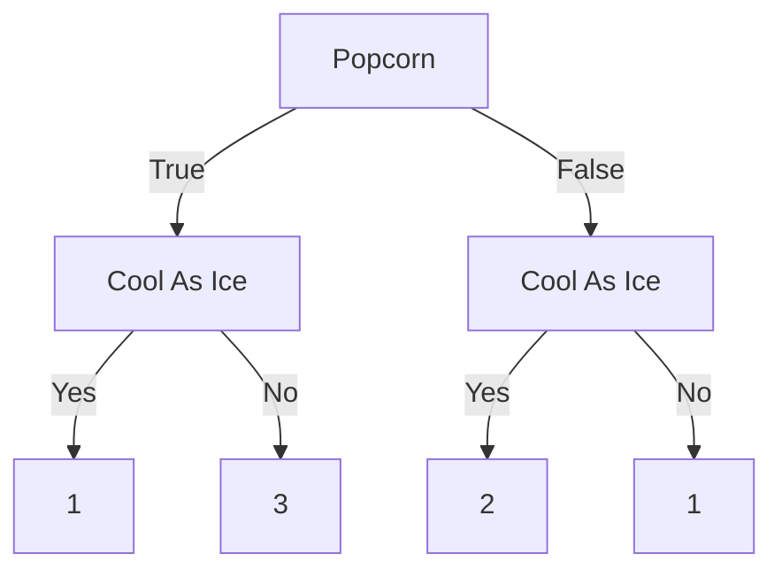
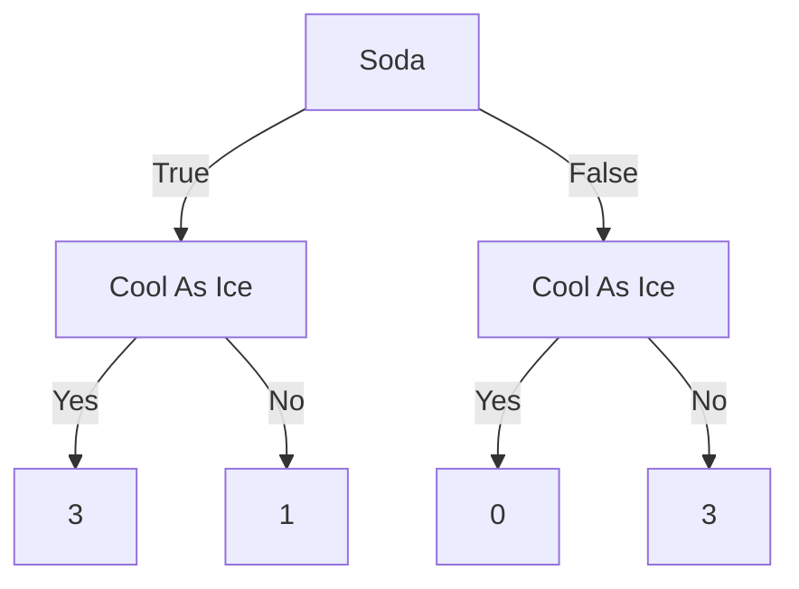

Верхушка дерева (С условием) называется Root node или же The root.
Остальные условия называют Branches или или Internal nodes.
Все, что принимает результат - Leaves or Leaf nodes.

У нас есть какой-то датафрейм

| Loves Popcorn | Loves Soda | Age | Loves Cool As Ice |
| ------------- | ---------- | --- | ----------------- |
| Yes           | Yes        | 7   | No                |
| Yes           | No         | 12  | No                |
| No            | Yes        | 18  | Yes               |
| No            | Yes        | 35  | Yes               |
| Yes           | Yes        | 38  | Yes               |
| Yes           | No         | 50  | No                |
| No            | No         | 83  | No                |

Impure - если смесь Yes и No у одного Leaf, допустим 3/1 это impure, 0/3 - нет.

Gini impurity один из самых популярных, но еще есть Entropy, Information Gain.

$\text{Gini impurity for a Leaf} = 1 - \text{(probability of "Yes")}^{2} - \text{(probability of "No")}^{2}$

$Gini = 1-\left( \frac{1}{1+3} \right)^{2} - (\frac{3}{1+3})^{2}$

$\text{Total gini impurity = weighted average of gini impurities for the Leaves}$
$\text{Total gini} = \left( \frac{4}{4+3} \right)0.375 + (\frac{3}{4+3})0.444$

Выбор признака для условия посредством создания простого дерева при помощь Gini Impurity или Entropy -> 