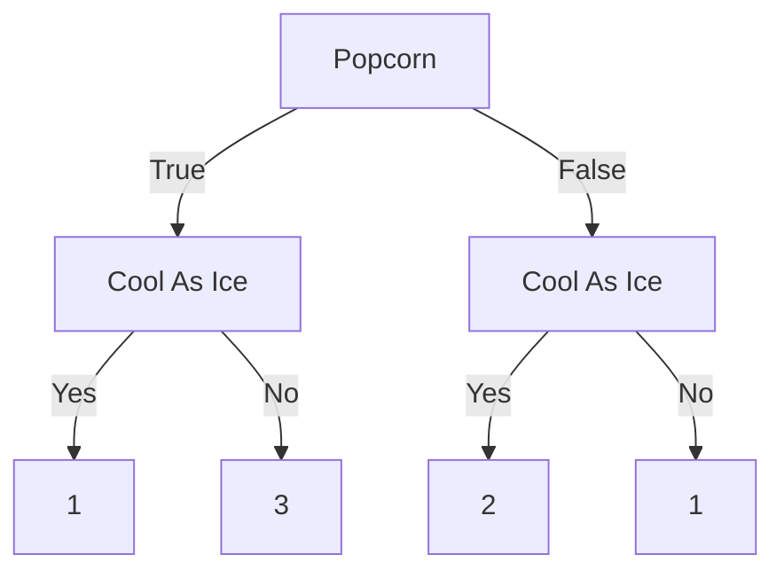
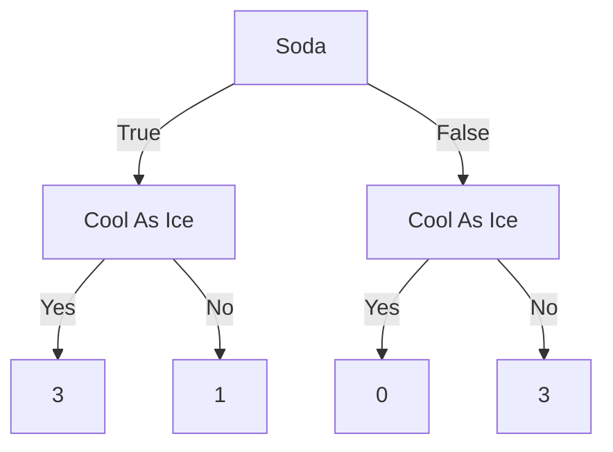

# Набор Джентльмена по ML 😈

## Основные алгоритмы

### Linear Regression
- MSE, аналитическое решение (Normal Equation), градиентный спуск
- Интерпретируемость коэффициентов
- Проблема мультиколлинеарности

**Вопросы:**
- Что такое MSE и зачем он нужен?
- Как выглядит аналитическое решение задачи линейной регрессии?
- Когда стоит использовать градиентный спуск вместо нормального уравнения?
- Как интерпретировать коэффициенты в линейной регрессии?
- Что такое мультиколлинеарность и как с ней бороться?
 
### Logistic Regression
- Сигмоида, логистическая функция

$$
\sigma(z) = \frac{1}{1 + e^{-z}}
$$
Определена (0, 1) - идеально для вероятностей, монотонная, S образная

- Cross-entropy

$$
L(y, \hat{y}) = -[y\log(\hat{y}) + (1-y)\log(1-\hat{y})]
$$
y - истинная метка,
$\hat{y}$ - предсказанная метка.

- Интерпретация вероятностей

$\sigma(z)$ - вероятность принадлежности к положительному классу
$1 - \sigma(z)$ - вероятность принадлежности к отрицательному классу

Odds (шансы):

$$
Odds = P(x=1\mid x) / P(y = 0 \mid x) = \sigma(z) / (1 - \sigma(x)) = e^{z}
$$
Log odds (логарифм шансов):
$$
\text{Log-odds} = z = w_{0} + w_{1}x_{1} + \dots + w_{n}x_{n}
$$
- Проблема несбалансированных данных

**Вопросы:**
- В чём разница между линейной и логистической регрессией?
- Почему в логистической регрессии используется сигмоида?
- Что такое кросс-энтропия?
- Как логрег решает задачу с несбалансированными классами?

### Decision Tree
- Критерии: Gini, Entropy

Gini impurity:
$$
Gini = 1 - \sum(p_{i})^{2}
$$
Для многоклассовой:
$$
Gini = 1 - \sum_{i=1}^{c}(p_{i})^{2}
$$
Где $p_{i}$ это доля объектов класса i в узле

Пример:
``` python
Узел с распределением [30, 20] объектов двух классов:
p₁ = 30/50 = 0.6
p₂ = 20/50 = 0.4
Gini = 1 - (0.6² + 0.4²) = 1 - (0.36 + 0.16) = 0.48
```

Верхушка дерева (С условием) называется Root node или же The root.
Остальные условия называют Branches или или Internal nodes.
Все, что принимает результат - Leaves or Leaf nodes.

У нас есть какой-то датафрейм

| Loves Popcorn | Loves Soda | Age | Loves Cool As Ice |
| ------------- | ---------- | --- | ----------------- |
| Yes           | Yes        | 7   | No                |
| Yes           | No         | 12  | No                |
| No            | Yes        | 18  | Yes               |
| No            | Yes        | 35  | Yes               |
| Yes           | Yes        | 38  | Yes               |
| Yes           | No         | 50  | No                |
| No            | No         | 83  | No                |







Impure - если смесь Yes и No у одного Leaf, допустим 3/1 это impure, 0/3 - нет.

Gini impurity один из самых популярных, но еще есть Entropy, Information Gain.

$\text{Gini impurity for a Leaf} = 1 - \text{(probability of "Yes")}^{2} - \text{(probability of "No")}^{2}$

$Gini = 1-\left( \frac{1}{1+3} \right)^{2} - (\frac{3}{1+3})^{2}$

$\text{Total gini impurity = weighted average of gini impurities for the Leaves}$
$\text{Total gini} = \left( \frac{4}{4+3} \right)0.375 + (\frac{3}{4+3})0.444$

Выбор признака для условия посредством создания простого дерева при помощь Gini Impurity или Entropy (Выбираем Min Impurity)

Энтропия:
$$
Entropy = -\sum_{i=1}^{c} p_{i} \log_{2}(p_{i})
$$

``` python
Тот же узел [30, 20]:
Entropy = -(0.6 × log₂(0.6) + 0.4 × log₂(0.4))
        = -(0.6 × (-0.737) + 0.4 × (-1.322))
        = -(-0.442 - 0.529) = 0.971
```

Энтропия медленнее, но точнее, создает более сбалансированные деревья.
Gini проще в интерпретации, имеет чуть хуже точность, но работает быстрее.

 ##### **Overfitting, Pruning**

- Слишком глубокие деревья
- Слишком маленькие листовые узлы
- Отсутствие ограничений на сложность
- Зашумленные данные

- Feature Importance


- Out-of-bag (в RF)

**Вопросы:**
- Как работает дерево решений?
- Что выбрать — Gini или Entropy?
- Как деревья переобучаются и как этого избежать?
- Как вычисляется важность признаков?

### Random Forest
- Бэггинг, bootstrapping
- Уменьшение дисперсии

**Вопросы:**
- Что такое бэггинг?
- Как работает случайный лес?
- Почему RF устойчив к переобучению?
- Как оценивается производительность без валидации (out-of-bag)?

### Gradient Boosting (XGBoost, LightGBM, CatBoost)
- Аддитивные модели
- Слабые ученики
- Лосс-функции (log-loss, MAE, Huber)

**Вопросы:**
- В чём идея градиентного бустинга?
- Почему слабые модели важны?
- В чём плюсы XGBoost/LightGBM/CB?
- Когда использовать Huber вместо MSE?

### KNN
- Чувствительность к масштабу
- KD/ball trees
- Высокая размерность

**Вопросы:**
- Как работает KNN?
- Почему масштаб признаков важен?
- Как ускорить поиск ближайших соседей?
- Почему KNN плохо работает в high-dimensional space?

### SVM
- Максимизация отступа
- Kernel trick: linear, RBF
- Параметры C и gamma

**Вопросы:**
- В чём идея SVM?
- Зачем нужен kernel trick?
- Что делает параметр C?
- Как выбрать ядро?

### Naive Bayes
- Байесовская теорема
- Независимость признаков
- Применение в NLP

**Вопросы:**
- В чём суть наивного Байеса?
- Почему он "наивный"?
- Когда он работает хорошо?

### K-Means, K-Means++
- Инициализация центров
- Inertia, Elbow method
- Silhouette score

**Вопросы:**
- Как работает K-Means?
- Зачем нужен K-Means++?
- Как выбрать число кластеров?

### DBSCAN
- eps, min_samples
- Плотностная кластеризация
- Проблемы с плотностями

**Вопросы:**
- Чем DBSCAN отличается от K-Means?
- Что означают параметры eps и min_samples?
- Почему DBSCAN плохо работает при разных плотностях?

### Регуляризация
- L1, L2, Elastic Net

**Вопросы:**
- Чем L1 отличается от L2?
- Когда использовать Elastic Net?
- Как регуляризация влияет на переобучение?

---

## Нейросети

- MLP, CNN, RNN (LSTM, GRU)
- Backpropagation, softmax
- Activation functions: ReLU, tanh, sigmoid, LeakyReLU, GELU
- Проблемы затухающих/взрывающихся градиентов
- Инициализация весов: He/Xavier
- Loss: BCE, CCE, MSE
- Dropout, BatchNorm, Early stopping
- LR Scheduler
- Transfer learning: Fine-tuning vs Feature extraction

**Вопросы:**
- Как работает MLP?
- В чём плюсы CNN?
- Почему LSTM/GRU лучше обычных RNN?
- Что такое backpropagation?
- Какие функции активации где лучше применять?
- В чём разница BCE и CCE?
- Как работает dropout?
- Что такое transfer learning?

---

## Метрики

### Регрессия:
- MSE, MAE, RMSE, $R^2$, MAPE, Log loss

### Классификация:
- Accuracy, Precision, Recall, F1-score
- ROC-AUC, PR-AUC (разница!)

**Вопросы:**
- Чем MSE отличается от MAE?
- Когда использовать MAPE?
- В чём смысл ROC-AUC и PR-AUC?
- Как считать F1 и зачем он нужен?

---

## Feature Engineering

- Нормализация, стандартизация
- Encodings (OneHot, Label)
- PCA / t-SNE / UMAP
- Обработка пропусков (median, KNN, удаление)
- Выбор признаков (модели, mutual info, борута)
- Binning

**Вопросы:**
- Зачем нормализовать данные?
- В чём разница PCA и t-SNE?
- Как выбрать важные признаки?

---

## Балансировка

- SMOTE, oversampling, undersampling
- class weights
- Использование Recall / PR-AUC / F1

**Вопросы:**
- Как справляться с дисбалансом классов?
- Когда использовать SMOTE?
- Зачем задавать class_weight?

---

## Misc

- Bias² + Variance + Noise: Expected Error
- Train/Val/Test Split
- K-Fold, Stratified CV
- Grid / Random / Bayesian Optimization
- Data Leakage
- Cold Start
- Concept Drift
- Проблемы оптимизации
- Optimizers: SGD, Adam, RMSprop, Adagrad

**Вопросы:**
- Что такое Bias-Variance tradeoff?
- Как правильно делать K-Fold?
- Как происходит data leakage?
- Что такое concept drift?
- Чем Adam отличается от SGD?

# Статистика

Вероятность события
Условная вероятность
Теорема Байеса
Случайные величины:
Математическое ожидание
Дисперсия
Распределения:
Биномиальное распределение
Нормальное распределение
Пуассоновское распределение
Закон больших чисел и центральная предельная теорема
Математическая статистика:
Выборочные характеристики:
Выборочное среднее
Выборочная дисперсия
Доверительные интервалы
Тестирование гипотез:
Нулевая и альтернативная гипотезы
Критерий значимости (p-value)
Регрессия:
Линейная регрессия
Метод наименьших квадратов
Критерии согласия:
Критерий хи-квадрат