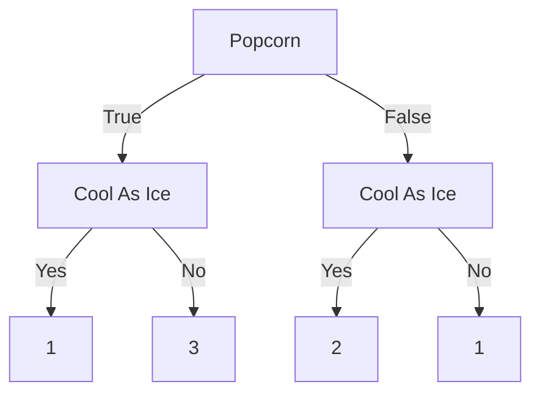

Верхушка дерева (С условием) называется Root node или же The root.
Остальные условия называют Branches или или Internal nodes.
Все, что принимает результат - Leaves or Leaf nodes.

У нас есть какой-то датафрейм

| Loves Popcorn | Loves Soda | Age | Loves Cool As Ice |
| ------------- | ---------- | --- | ----------------- |
| Yes           | Yes        | 7   | No                |
| Yes           | No         | 12  | No                |
| No            | Yes        | 18  | Yes               |
| No            | Yes        | 35  | Yes               |
| Yes           | Yes        | 38  | Yes               |
| Yes           | No         | 50  | No                |
| No            | No         | 83  | No                |

